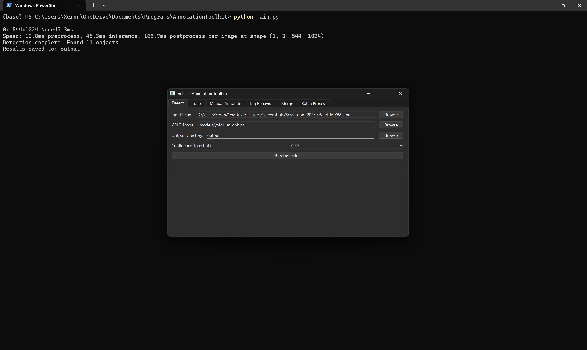
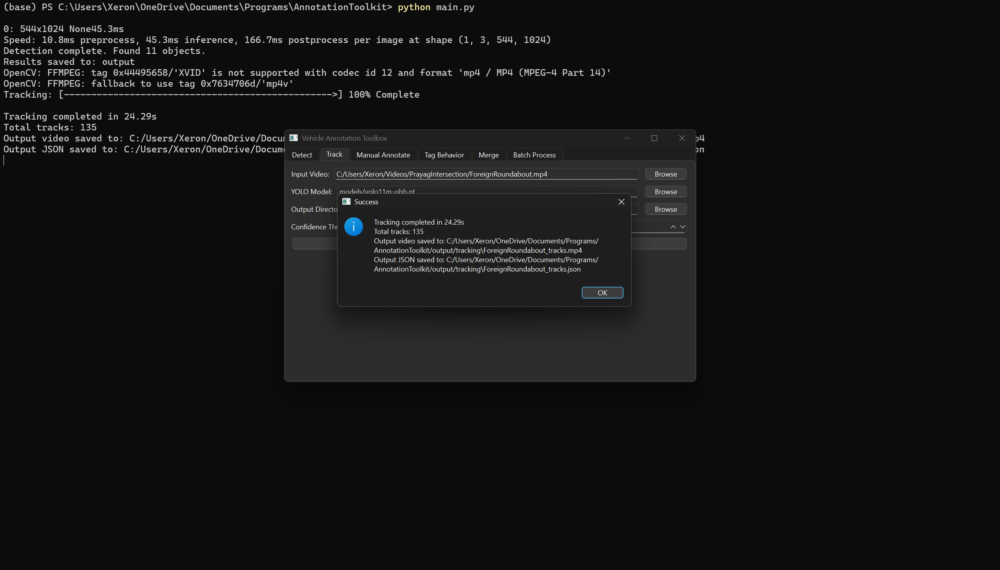
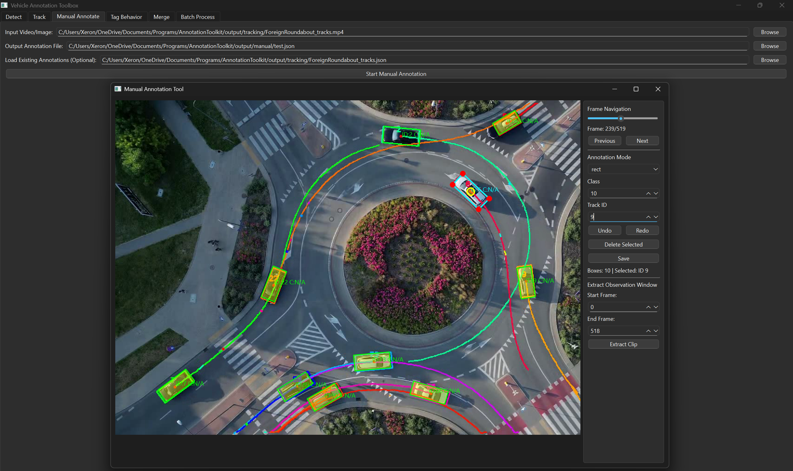
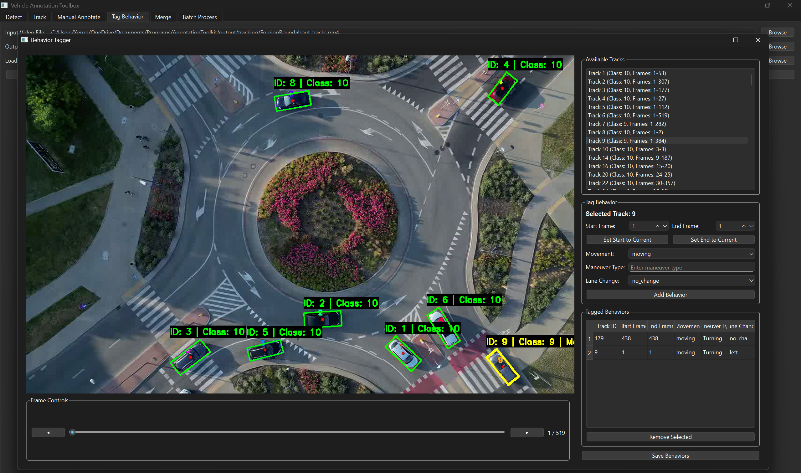
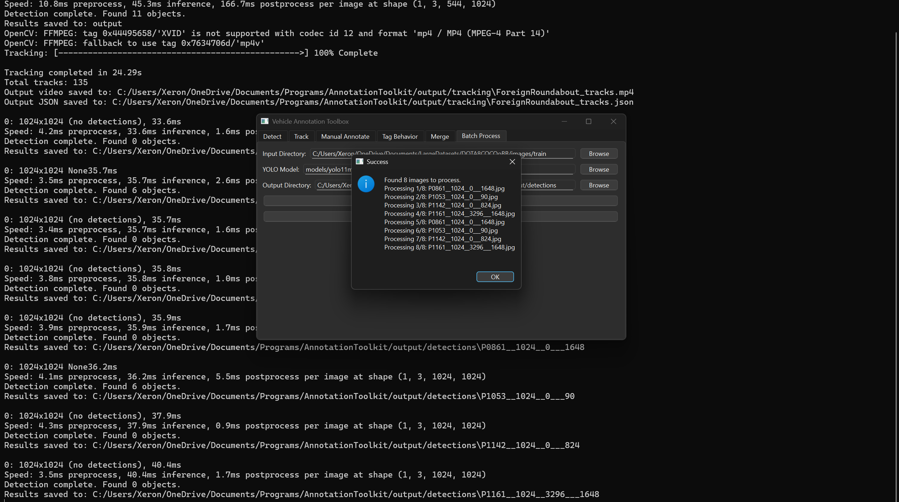

# Vehicle Annotation Toolbox

An automatic annotation toolbox that uses YOLO for vehicle detection and BoT-SORT for tracking. The toolbox features a comprehensive GUI for processing single files, running batch jobs, performing manual annotations, and tagging vehicle behaviors.

## Requirements (Ideally)

* Windows 11
* Python 3.11
* CUDA 12.1

## Installation

To install the required dependencies, run the following command:

```bash
pip install -r requirements.txt
````

## Model Setup

Download the required models and place them in the `models/` directory:

1.  **YOLO Model**: Place `yolo11m-obb.pt/yolo11m.pt` or your custom pretrained model in the `models/` directory. This is the default model path used by the application.
2.  **ReID Model**: Download `veriwild_bot_R50-ibn.pth` from the [fast-reid MODEL\_ZOO](https://github.com/JDAI-CV/fast-reid/blob/master/MODEL_ZOO.md) or your custom ReID and place it in the `models/` directory. This model is required for the BoT-SORT tracker with ReID enabled.

## Folder Structure

```
project/
├── main.py              #Main GUI application entry point
├── batch_process.py     #Batch processing functions
├── config.py            #Configuration settings
├── utils.py             #Utility functions
├── setup.py             #Package setup
├── requirements.txt     #Dependencies
├── README.md            #This file
├── botsort.yaml         #BoT-SORT tracker configuration
├── modules/             #Core modules
│   ├── __init__.py
│   ├── detector.py      #YOLO based detection logic
│   ├── tracker.py       #BoT-SORT tracking logic
│   ├── annotator.py     #Manual annotation GUI
│   ├── behavior.py      #Behavior tagging GUI
│   └── exporter.py      #Data merging logic
├── models/              #YOLO and ReID models
│   ├── yolo11m-obb.pt
│   └── veriwild_bot_R50-ibn.pth
└── output/              #Default output directory
    ├── detections/
    ├── tracking/
    ├── manual/
    └── behaviors/
```

## Usage

Run the main application from the command line, which will open the Vehicle Annotation Toolbox GUI.

```bash
python main.py
```

The application is organized into several tabs for different functionalities.

### Detect Tab

This tab is used for running vehicle detection on a single image file.

  * **Input Image**: Select the image file to process.
  * **YOLO Model**: Specify the path to the `.pt` model file.
  * **Output Directory**: Choose where the annotated image and `detections.json` file will be saved.
  * **Confidence Threshold**: Set the confidence threshold for detection.



### Track Tab

This tab is used for running vehicle tracking on a single video file.

  * **Input Video**: Select the video file to process.
  * **YOLO Model**: Specify the path to the `.pt` model file.
  * **Output Directory**: Choose where the annotated video and `_tracks.json` file will be saved.
  * **Confidence Threshold**: Set the confidence threshold for tracking.



### Manual Annotate Tab

Launches a dedicated window for manual annotation of objects in images or videos.

  * **Input Video/Image**: Select the media file to annotate.
  * **Output Annotation File**: Specify the `.json` file to save annotations to.
  * **Load Existing Annotations**: Optionally load a previously saved annotation file to continue editing.
  * **Controls**:
      * **Mouse**: Draw bounding boxes on the canvas.
      * **Delete Key**: Deletes the currently selected annotation box in the current frame.
      * **Ctrl+Z**: Undo the last action.
      * **Ctrl+Shift+Z**: Redo the last undone action.
      * **Buttons**: Use the "Previous" and "Next" buttons for frame navigation, and "Save" to save progress.



### Tag Behavior Tab

Launches a dedicated window for tagging behaviors of tracked vehicles in a video. This requires a video file and its corresponding tracks JSON file generated from the "Track" tab.

  * **Input Video File**: Select the video file for behavior tagging.
  * **Output Behaviors File**: Specify the `.json` file where behavior tags will be saved.
  * **Load Existing Behaviors**: Optionally load a previously saved behaviors file.
  * **Controls**:
      * **Click**: Select a tracked vehicle in the video frame to tag its behavior.
      * **Keyboard Shortcuts**: Use 'A' and 'S' to set the start and end frames for a behavior, and 'Left'/'Right' arrow keys for frame navigation.
   


### Merge Tab

This tab is used to merge annotations from manual edits, automatic tracking, and behavior tagging into a single, comprehensive JSON file.

  * **Manual Annotations (Optional)**: Select the JSON file containing manual annotations.
  * **Tracks File (Optional)**: Select the `_tracks.json` file generated from the "Track" tab.
  * **Behaviors File (Optional)**: Select the JSON file containing behavior tags.
  * **Merged Output File**: Specify the output `.json` file to save the merged data.

### Batch Process Tab

This tab allows for running detection or tracking on a directory of images or videos, respectively.

  * **Input Directory**: Select the folder containing the media files.
  * **YOLO Model**: Specify the path to the `.pt` model file.
  * **Output Directory**: Choose a parent directory for the output results. The tool will create subdirectories for each processed file.



## BoT-SORT Configuration

The tracker uses BoT-SORT with ReID features for improved tracking accuracy. The configuration is located in `botsort.yaml`.

  * **ReID Model**: Uses a VeRi-Wild pretrained model for vehicle re-identification.
  * **Track Buffer**: Set to 100 frames for better handling of long-term occlusions.
  * **Appearance Matching**: Combines motion and appearance (ReID) features for robust tracking.
  * **Global Motion Compensation**: Uses sparse optical flow to compensate for camera movement.

## Output Format

All detections, tracks, and behaviors are saved in a structured JSON format for consistency and ease of use in downstream tasks.

## Download the pretrained models:
1. **YOLOv11**: https://docs.ultralytics.com/models/yolo11/#performance-metrics
2. **Veri-Wild ReID**: https://github.com/JDAI-CV/fast-reid/blob/master/MODEL_ZOO.md


## Troubleshooting

1.  **ReID Model Not Found**: Ensure the `veriwild_bot_R50-ibn.pth` file is correctly placed in the `models/` directory.
2.  **CUDA Issues**: Verify that your PyTorch installation is compatible with your installed CUDA 12.1 toolkit.
3.  **Ideal Structure (to avoid issues)**: Make sure to create a 'models' and an (optional) 'output' folder for creation of the datatset.
